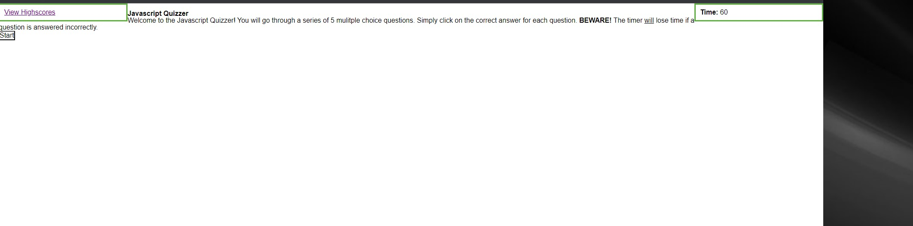

# JavaScript quiz

## Description

This JavaScript Quiz webpage was created to help students review JavaScript concepts. This contains a timer interval to help the student measure how quickly they can answer correctly. This contains questions strictly related to JavaScript.

## Installation

N/A

## Usage

To use this JavaScript Quiz website, you can 'click' the start button to start the quiz and timer. The questions are multiple choice and wrong guesses will deduct 10 seconds from the clock. The final score at the end will be logged into a highscore page.

[JavaScript Quiz Webpage](https://barcar95.github.io/javascript-quiz/)

## Credits

N/A

## License

Please refer to the LICENSE in the repo.
